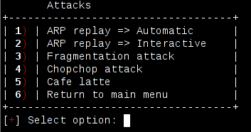

Wep attacks
-----------

.. image:: images/wep-attacks.png

Attacks not using a client
==========================

.. image:: images/wep-attacks-noclient.png

If you have no connected clients (for example, if you've only got one wireless card, and you're auditing your own network)
you might need to use this attacks.

Fake auth (Automatic)
+++++++++++++++++++++++

Airoscript here performs a fake auth attack, to associate with AP, and a arp replay attack for injection, typically doing something like:

::

    aireplay-ng WIFI_INTERFACE --arpreplay -b TARJET_MAC -d INJECTION_MAC -f 1 -m 68 -h FAKE_MAC -x 1000
    aireplay-ng -3 -b AP_MAC -h SOURCE_MAC WIFI_INTERFACE

Where source mac (in this case) is INJ_MAC

That is, fake auth and arp replay attacks. Basically, according to aircrack-ng wiki:

::

    The fake authentication attack allows you to perform the two types of WEP 
    authentication (Open System and Shared Key) plus associate with the access point (AP). 
    This is only useful when you need an associated MAC address in various aireplay-ng attacks
    and there is currently no associated client. It should be noted that the fake authentication
    attack does NOT generate any ARP packets. Fake authentication cannot be used to 
    authenticate/associate with WPA/WPA2 Access Points.

    The classic ARP request replay attack is the most effective way to generate new
    initialization vectors (IVs), and works very reliably. The program listens for an ARP packet
    then retransmits it back to the access point. This, in turn, causes the access point to repeat
    the ARP packet with a new IV. The program retransmits the same ARP packet over and over. 
    However, each ARP packet repeated by the access point has a new IVs. It is all these new IVs
    which allow you to determine the WEP key.

In interactive mode, you'll be asked for the "f" (from-to destination bit), making you able to make it into a t, and the destmac (wich, by default, is FF:FF:FF:FF:FF:FF)

Have a look at _Fake auth at aircrack-ng wiki: http://www.aircrack-ng.org/doku.php?id=fake_authentication 
and _ARP replay at: http://www.aircrack-ng.org/doku.php?id=arp-request_reinjection

Fake auth (Interactive)
+++++++++++++++++++++++
Almost same as fake auth, automatic, except for aireplay being called in interactive mode, wich will force the user to select a packet instead of injecting the first that it gets.

Have a look at _Fake auth at aircrack-ng wiki: http://www.aircrack-ng.org/doku.php?id=fake_authentication

Fragmentation attack
+++++++++++++++++++++++

Here, airoscript-ng kills *every airodump-ng and aireplay-ng processes* (-9 kill, be careful as all airodump processes will stop recording and not save data) and removes all old fragmentation captures and normal captures (hard-cleans everything). Be careful!

Note to self: IF NO _DUMP_PATH_ PROVIDED, AND NO HOST MAC PROVIDED (It's imposible to get here with airoscript, just if you source attacks/wep and execute directly wep_attacks_fragmentation) it will do a rm /* wich is dangerous

Then it launches aireplay, in this case, assuming you've no clients, with injection (-5, --fragment option) like this:

::
    
    aireplay-ng -5 -b AP_MAC -h FAKE_MAC -k FRAG_CLIENT_IP -l FRAG_HOST_IP WIFI_INTERFACE

Have a look at _Fragmentation at aircrack-ng wiki: www.aircrack-ng.org/doku.php?id=fragmentation

Chopchop attack
+++++++++++++++

Makes a hardclean. Starts capturing, fake auth (3) and aireplay with chopchop attack, then it calls
the _Injection menu: injection.html

::

    aireplay --chopchop -b AP_MAC -h FAKE_MAC WIFI_INTERFACE

According to aircrack-ng wiki:

::

    This attack, when successful, can decrypt a WEP data packet without knowing the key. 
    It can even work against dynamic WEP. This attack does not recover the WEP key itself, 
    but merely reveals the plaintext. However, some access points are not vulnerable to this
    attack. Some may seem vulnerable at first but actually drop data packets shorter
    that 60 bytes. If the access point drops packets shorter than 42 bytes, aireplay
    tries to guess the rest of the missing data, as far as the headers are predictable. 
    If an IP packet is captured, it additionally checks if the checksum of the header
    is correct after guessing the missing parts of it. This attack requires at
    least one WEP data packet. 

Have a look at its aircrack-ng docs at _aircrack-ng wiki: http://www.aircrack-ng.org/doku.php?id=korek_chopchop

Attacks using a client
======================

When the ap has a client connected, you can use the following attacks.

Arp replay (Automatic)
+++++++++++++++++++++++

Calls aireplay-ng for a arpreplay, as in fake auth, except that does not execute a fake auth attack.

::
    
    aireplay WIFI_INTERFACE --arpreplay -b AP_MAC -d INJECTION_MAC\
    -f 1 -m 68 -n 86 -h CLIENT_MAC -x INJECTRATE 

Arp replay (Interactive)
++++++++++++++++++++++++

Same as previous attack, interactive mode.

Fragmentation attack
+++++++++++++++++++++++

Have a look at fragmentation attack without clients, this is basically the same,
except for aireplay-ng being called with -7 option, like this:

::

    aireplay-ng -7 -b AP_MAC -h CLIENT_MAC -k FRAG_CLIENT_IP -l FRAG_HOST_IP WIFI_INTERFACE

Have a look at _Fragmentation at aircrack-ng wiki: www.aircrack-ng.org/doku.php?id=fragmentation

Chopchop attack
+++++++++++++++

Almost the same as non-client directed chopchop, except this one does not make a fake_auth attack, and provides client_mac like this:

::

    aireplay-ng --chopchop -h CLIENT_MAC WIFI_INTERFACE

It also calls inject menu, directed for chopchop.

Cafe latte attack 
+++++++++++++++++

It just executes fakeauth3 and caffe late attack ( -6 option to aireplay-ng )

According to aircrack-ng wiki:

::

    The Cafe Latte attack allows you to obtain a WEP key from a client system. 
    Briefly, this is done by capturing an ARP packet from the client, manipulating
    it and then send it back to the client. The client in turn generates packets 
    which can be captured by airodump-ng. Subsequently, aircrack-ng can be used
    to determine the WEP key.

Have a look at its aircrack-ng docs at _aircrack-ng wiki: http://www.aircrack-ng.org/doku.php?id=caffe-lat
